# Computer Networking Notes

Notes for the book *Computer Networking: A Top Down Approach* and more.

## Develop Reliable Transmission 

### Naive Model

Send when needed.

Receive when needed.

### Consider Bit Error(s)/Corruptions in Packets

Add ACK/NACK mechanism.

1. ACK when there is no error detected. NACK when error detected.
2. ACK/NACK upon receiving.
3. Resend when NACK.

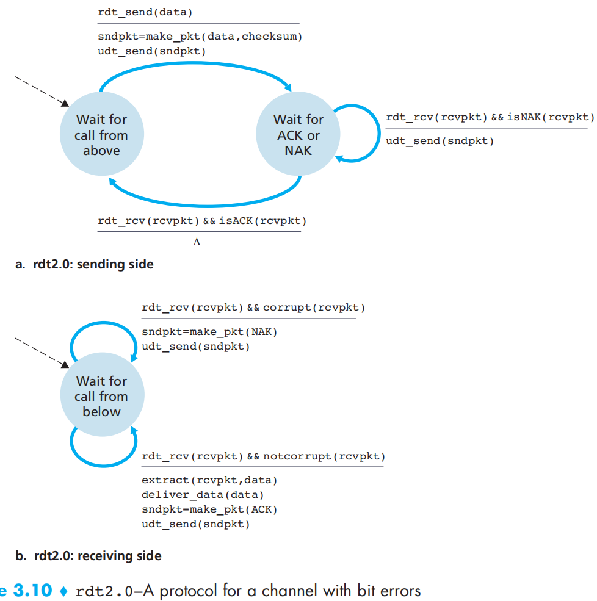

### Consider Corruptions in ACK/NACK

Add *sequence number* of 1 bit, signifying whether this is an ACK or data packet.

1. Sender resends when having corrupted ACK/NACK, or treat all corrupted ACK/NACKs as NACK.
2. Receiver ACK when having out-of-order packets.

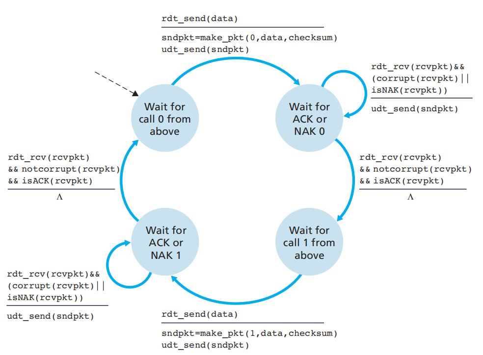

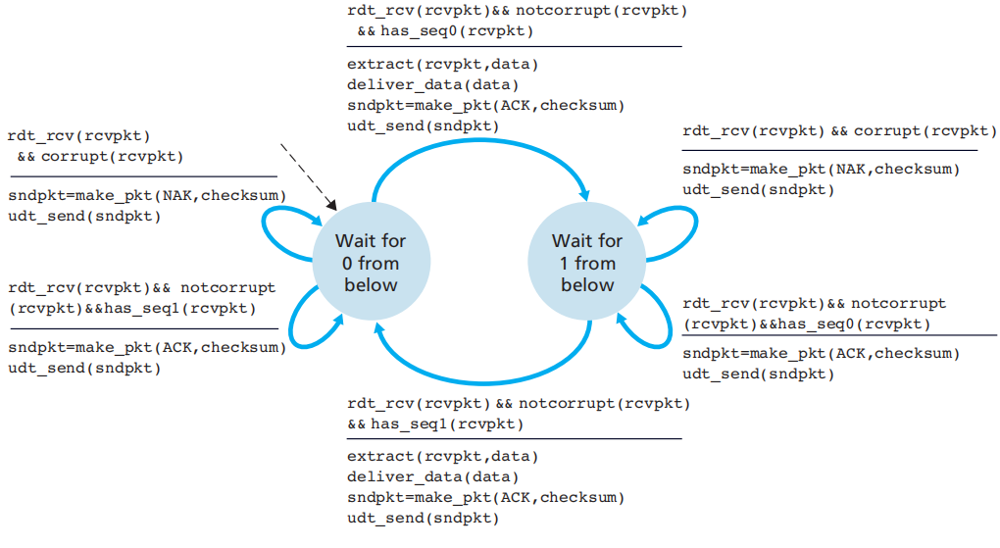

Possible duplicates in this scenario, when the packet is correctly received and the ACK is corrupted. The packet is resent to the receiver. The receiver is expecting another sequence number, but would ACK this one anyway, not updating the packet to the upper layer. The procedure is back to normal.

### Drop NACK

Replace NACK mechanism with duplicate ACKs.

1. Receiver ACK the last correctly received packet when meeting corruption.
2. Sender knows corruption by duplicated ACKs, or ACKs out of order by 1 step.

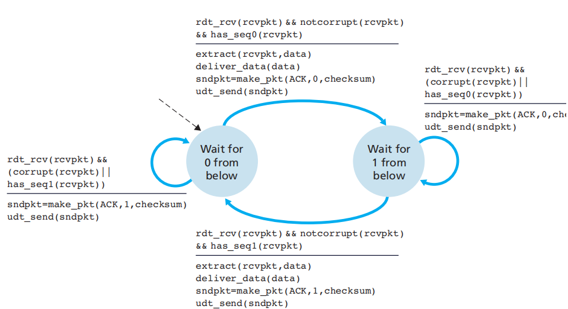

### Consider Packet Loss

Add *wait for ACK* mechanism.

1. Sender waits for a certain time after sending for receiver to ACK.
2. Resend after time expired.

### Consider Coincidence Slow

When an ACK arrives after sender's waiting time, sender sends another duplicated packet to the receiver. This duplicate can be perfectly handled by the current mechanism. The receiver does not update the duplicate to its upper layer, but ACK it anyway. The duplicate will be ACKed and the sender ignores that ACK. Everything is back to normal.

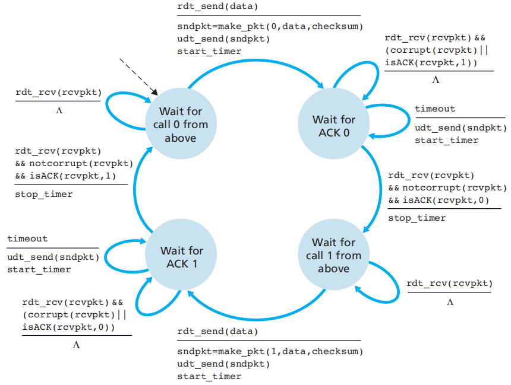

This is the new sender FSM, with nothing to change in the receiver.

The FSMs mentioned above are often symmetric, due to the similar behaviors under sequence number 0 or 1.

## Pipeline

### Sliding Window

#### Sequence Number

The range of sequence numbers can be larger or equal to the window size. The initial value of sequence number can be any value between the valid range, as in the stop-and-wait protocol.

#### Window Size

The window size is fixed for the congestion control mechanism.

### GBN

Go-Back-N protocol, namely go back and resend from the failed packet to the end of the window. 

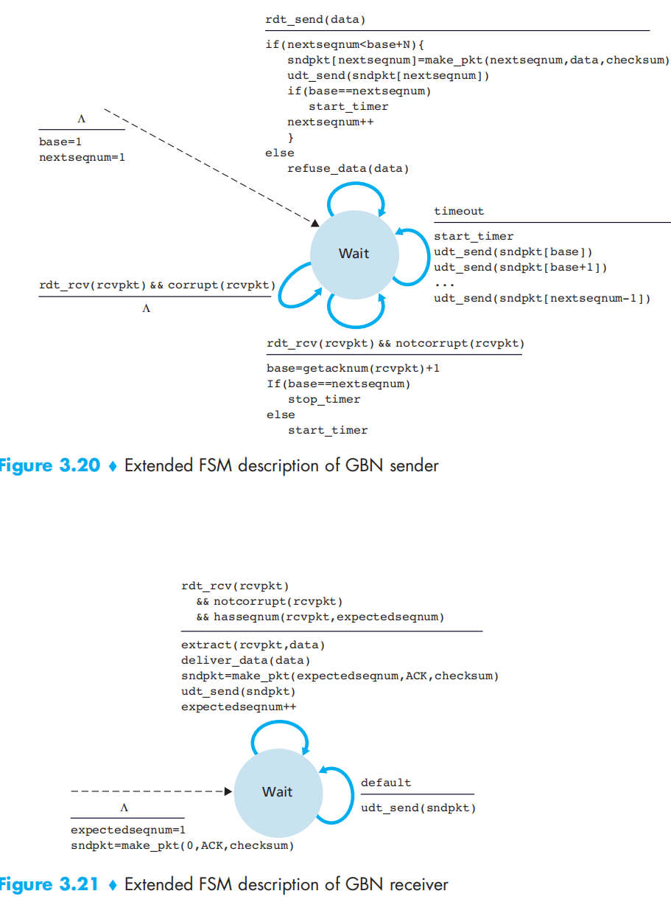

Sender:

1. Refuse input from upper layer or provide synchronizing mechanism.
2. When time expired, resend all packets following the last ACKed packet.
3. Timer stopped when the window is closed.

Receiver:

1. ACK when the packets are uncorrupted and in order.
2. Otherwise, resend ACK of the last correctly received packet, discard all of the followings.

### Selective Repeat

Sender:

1. Same when dealing with upper layer.
2. Each packet has a logical timer, implemented by a single physical timer. The packet is resent when time expired.
3. On receiving an ACK, if the sequence number matches the left-most packet inside the window, the left edge of the window shrinks, confirming the success in sending one more packet, as is the normal case.
4. If the sequence number does not match, out-of-order packages are detected, wait for corresponding ACKs and do nothing.

Receiver:

1. Maintain a range of sequence number, signifying the correctly received packets. On arrival of a new packet, if the sequence number falls into this range, the packet is marked duplicate and ACKed, not propagated to the upper layer, as is done before.
2. If the sequence number falls on the right-hand-side of the range, the packet is marked not previously received and buffered and ACKed, as is the normal case.

#### Too Large Window Size

Suppose the window size equals the largest sequence number minus 1. When the last of the sequence number is used, and the sequence number goes back to 0, if the timer of packet 0 previously sent expires right now, the packet currently sent can not be distinguished between a new data or a retransmission.

The appropriate mechanism should be that let the window size be less than or equal to half of the largest sequence number.

## TCP Contents

### Segment Structure

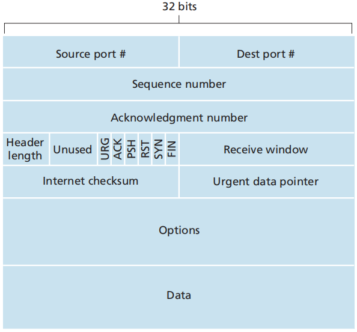

#### Sequence Number and Acknowledgment Number

For large sequence transmission.

*Sequence Number* signifies the beginning of the TCP segment. It tells the current working position of the transmission.

Suppose the file to be transmitted is 5e5 bytes long, separated into segments each with 1e3 bytes. The sequence numbers of each of the segments are 0, 1e3, 2e3, 3e3, ...

*Acknowledgement Number* is for the receiver to tell the sender the next sequence number it is expecting.

Suppose the receiver successfully obtained 500 bytes from sender. The acknowledgement number should be 501, telling the sender to send the segment with sequence number 501.

By the mechanism provided by sequence and acknowledgement number, TCP implements either GBN or SR protocol.

In actual TCP data transmission, ACKs and packets can be merged into one. The server may send back a segment in response to the segment sent by the client. The segment carries the new acknowledgment number, implying the next sequence number from the client, and serving as an ACK to the previous segment.

When there is no need of sending back a segment as an response, the server or client sends a "pure ACK" segment, with no data in the data field and others the same.

### RTT Estimation

Iteratively update:
$$
EstimatedRTT=(1-\alpha)\cdot EstimatedRTT+\alpha\cdot SampleRTT,\alpha=0.125
$$
Variability estimation:
$$
DevRTT=(1-\beta)\cdot DevRTT+\beta\cdot|SampleRTT-EstimatedRTT|,\beta=0.25
$$
Time out interval:
$$
TimeoutInterval=EstimatedRTT+4\cdot DevRTT
$$
with initial value 1 second.

Each time when a segment is received, EstimatedRTT is updated.

Each time a timeout event occurs, RTT Estimation is doubled, not updated by the normal iterative method.

### Working Scenario

#### Normal Steps

Sender:

1. Data received from upper layer. Encapsulates the data and pass down to IP protocol. Sequence and acknowledgment numbers are set. Start the timer if not on.
2. Upon timer expiration, resend the corresponding segment.
3. Upon ACK arrival, compare the acknowledgment number of the ACK segment with the local state. Update the local state (numbers and RTT estimation) and reset timer.

#### 3 Scenarios

If the ACK of a segment is lost and timeout event occurs, the client resend the segment and the server ACK once more, not updating the segment to the upper layer, as is done before.

Another more complicated one is this. Suppose 2 segments are sent continuously, and their ACKs arrive after the timeout event of the first one. Before any of the ACKs arrive, the first segment is sent. The first ACK will come after the first duplicate is sent. Client will treat it as the ACK for the first duplicate and work fine. As long as the second ACK arrives before the timeout of the duplicates, there will be no second duplicate.

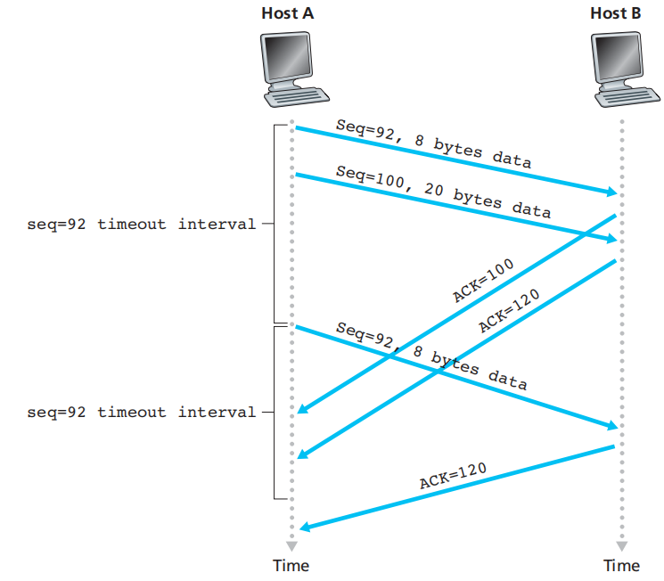

The last scenario is a little different from the previous one. Suppose the second ACK arrives at the client before timeout, and the first ACK is lost. There will be no duplicates, for the server always ACKs the last correctly received segment.

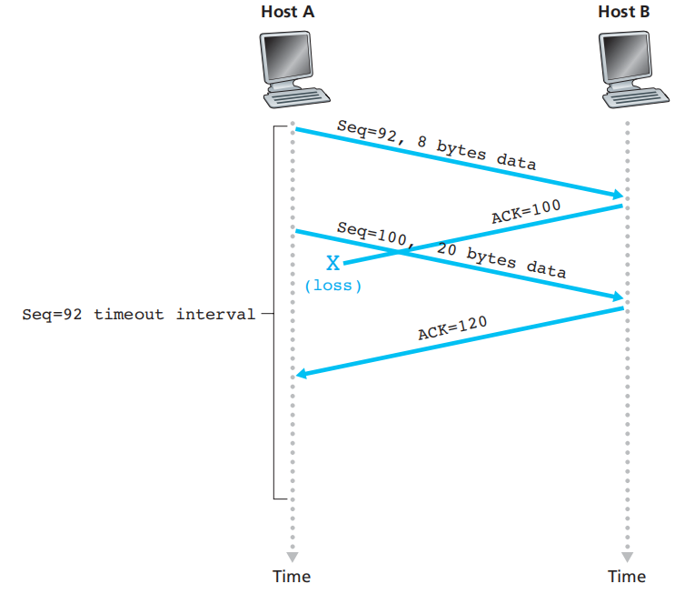

### Fast Retransmission

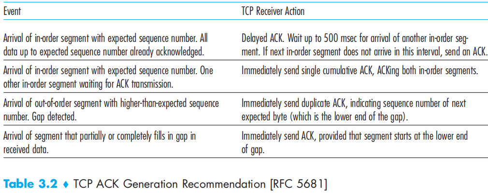

TCP does not provide explicit NACK mechanism, as is told before. NACK is replaced by a duplicate ACK of the last correctly received segment.

When 3 duplicate ACKs for the same segment are received by the client, the client perform the fast retransmit procedure. Client retransmits the failed segment before the corresponding timer expires.

### Flow Control

#### Clarification

Flow control is not congestion control. Flow Control is to prevent the sender from overflowing the receiver 's buffer. It is a mean of speed matching. Congestion happens in an IP network, caused by too many datagrams inside the network.

#### Mechanism

Server sends its spare size in buffer to client, as the *Receive Window* field in the TCP segment. Client keeps its sending window, the segments between last sent byte and last ACKed byte, smaller than the receive window.

When the receive window expires, the server discard all enter segments.

When the receive window of server is 0, client must keep sending 1-byte segments to check whether it is valid to resume sending to server, or the client would not have the information of the new spare room in the server' s memory. The segments will be dropped when the receive window is full.

TCP is full-duplex, therefore both sides keep the receive window on the other side.

### Connection Management

#### Establish

1. Client sends SYN segment, setting SYN bit to 1, holding random initial sequence number.
2. Server sends back a connection-granted segment, setting SYN bit to 1, holding another random sequence number. The acknowledgement number is derived from the SYN segment. Also known as SYNACK segment (+1).
3. Client ACKs the SYNACK segment, with SYN bit set to 0, holding acknowledgement number derived from the SYNACK segment (+1).

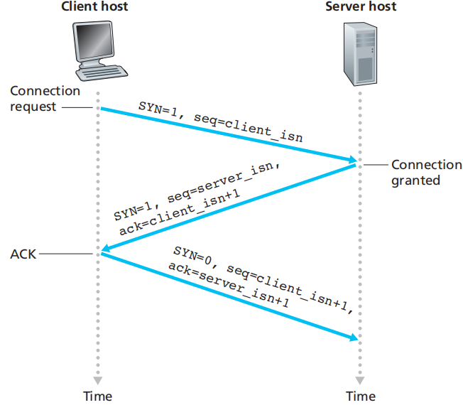

#### Close

1. Client sends FIN segment, setting FIN bit to 1.
2. Server sends back an ACK.
3. Server sends another FIN segment to client, setting FIN bit to 1.
4. Client ACK the FIN segment. Server does not respond to this ACK.
5. Some seconds after the ACK is sent, client closes the connection, deallocates everything, in case the ACK is lost.

#### States

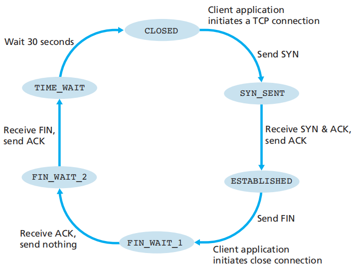

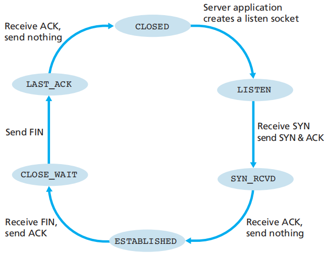

#### Special Scenarios

If the ports between the hosts are not connected, the client is establishing or closing a connection which does not exist. Server would send a reset segment to client, setting RST bit to 1. 

## TCP Congestion Control

Keep a *congestion window*. The difference between last byte sent and last byte ACKed should not only be constraint by the receive window, but also by the congestion window.

Roughly, the sending rate of the client is $cwnd/RTT$ bytes/sec.

As is told before, a packet-loss event is given by 3 duplicate ACKs. Principles:

- Sender rate should be decreased when a segment is lost. Packet loss event may be suggested by 3 duplicate ACKs.
- Sender rate should be increased when a segment is correctly received. All-is-well may be suggested by a correctly received ACK.
- The host should always probe for the limit of the bandwidth, increasing when not reached, and back off when too much.

### Slow Start

- Begins with congestion window of 1 MSS.
- Congestion window doubles itself upon the arrival of each ACK.
- Upon a timeout event, the process starts anew and set the congestion window back to 1 MSS, and sets record the value of the half of the congestion window size.
- When the congestion window size grows to the half of the maximum congestion window size last set, the process goes into the *congestion avoidance mode*.
- Upon a packet loss event triggered by 3 duplicate ACKs, the process enters the *fast recovery mode*.

### Congestion Avoidance

